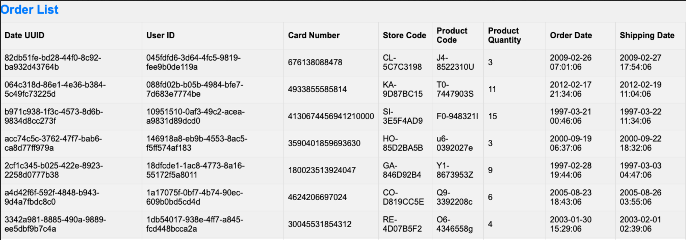
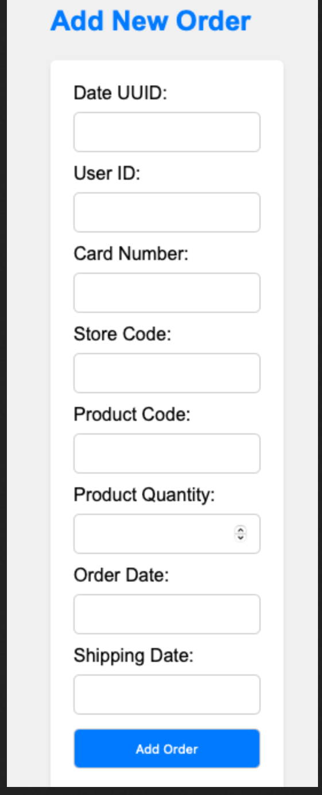
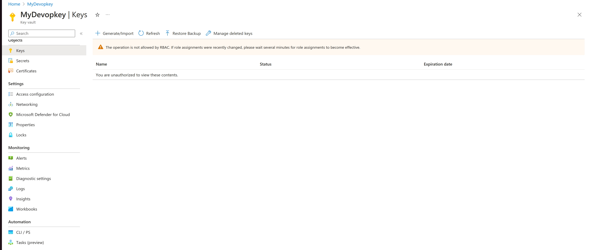

# Introduction 
The main gaol of this project is building a comprehensive end-to-end DevOps pipeline to support the organization's internal web application, designed to manage and monitor deliveries across the company.
Order List Page: Navigate to the "Order List" page to view all existing orders. Use the pagination controls to navigate between pages.Fig1

Add New Order Page: Click on the "Add New Order" tab to access the order form. Complete all required fields and ensure that your entries meet the specified criteria.Fig2

To do this changes, we will  implement version control, We will use Docker Hub as the preferred container registry, and will leverage Kubernetes to orchestrate the deployment of the containerized application. Lastly we will employ CI/CD (Continuous Integration/Continuous Deployment) practices to automate the build and deployment of the application, streamlining the development pipeline for efficiency and reliability.
We will add the  delivery_date column  in the backend database.
# Version Control
## Adding new feature.
    • Navigate to the forked repository at https://github.com/<Dereje2525>/Web-App-DevOps-Project
    • Create a new branch called feature/add-delivery-date. 
    • We modify the code to incorporate the delivery_date column. To do this we need to update both the app.py and order.html files in the repository.
    • Push the changes to the remote repository. 
    • Submit a pull request to merge the code changes from the feature branch into the main branch.
## Revert the changes made back.
    • Create a new branch called feature/add-delivery-date. 
    • We modify the code to incorporate the delivery_date column. To do this we need to update both the app.py and order.html files in the repository.
    • Push the changes to the remote repository. 
    • Submit a pull request to merge the code changes from the feature branch into the main branch.
# Containerize web application

## Create a Docker file for the application.
                                                                                               
FROM python:3.10-slim

WORKDIR /app
COPY . /app

RUN apt-get update && apt-get install -y \
    unixodbc unixodbc-dev odbcinst odbcinst1debian2 libpq-dev gcc && \
    apt-get install -y gnupg && \
    apt-get install -y wget && \
    wget -qO- https://packages.microsoft.com/keys/microsoft.asc | apt-key add - && \
    wget -qO- https://packages.microsoft.com/config/debian/10/prod.list > /etc/apt/sources.list.d/mssql-release.list && \
    apt-get update && \
    ACCEPT_EULA=Y apt-get install -y msodbcsql18 && \
    apt-get purge -y --auto-remove wget && \
    apt-get clean

RUN pip install --upgrade pip setuptools

COPY requirements.txt /opt/app/requirements.txt
WORKDIR /app
RUN pip install -r requirements.txt
COPY . /app
 
EXPOSE 5000

CMD ["python", "app.py"]
## Docker Commands:
    • Build Docker Image: docker build -t webapp
    • Run Docker Container Localy:docker run -p 5000:5000 webapp
    • Tag to Docker Hub: docker tag webapp Dere2525/webapp:1.0.0.
    • Push to Docker Hub: docker push webapp Dere2525

# Create Terraform Project  and Modules

## Defining a Network Module

In this module we will define Azure Networking components using Terraform.

We will follow the following steps to create a virtual network using Terraform.

1. We define the configuration of our Virtual Network using the azurerm_virtual_network resource block
2. We will define the subnets associated with the virtual network using the azurerm_subnet resource block.
3. we define Network Security Groups (NSGs) using Terraform's azurerm_network_security_group resource block
4. We will first define a Terraform configuration file (main.tf) that defines a VNet in Azure:

### Inpus Variable
variable "resource_group_name" {
  description = "The name of the created resource group."
  type        = string
}

variable "vnet_id" {
  description = "The ID of the created virtual network"
  type        = string
}

variable "control_plane_subnet" {
   description = "The name of the created subnet 1."
   type        = string
}

variable "resource_group_name" {
  description = "The name of the created resource group."
  type        = string
}

variable "vnet_address_space" {
  type        = list(string)
  description = "Address space  of the vnet"
}

variable "subnet_address_space" {
  type        = list(string)
  description = "Address space of the subnet"
}
  
variable "location" {
  description = "Location of resource group"
  type = string
  
}  

### Output Variable
output "networking_resource_group_name" {
  description = "The name of the created resource group."
  value       = azurerm_resource_group.network_pro.name 
}
output "networking_resource_group_name" {
  description = "The name of the created resource group."
  value       = azurerm_resource_group.network_pro.name 
}

output "vnet_id" {
  description = "The ID of the created virtual network."
  value       =  azurerm_virtual_network.vnet.id
}

output "control_plane_subnet_id" {
  description = "The ID of the created subnet 1."
  value       = azurerm_subnet.ask_subnet_1.id
}

output "worker_node_subnet_id" {
  description = "TheID of the created subnet 2."
  value       =  azurerm_subnet.ask_subnet_2.id
}

output "resource_group_name" {
  description = "Name of the Azure Resource Group for networking resources."
  value       = azurerm_resource_group.network_pro.name
}
output "aks_nsg_id" {
  description = "ID of the Network Security Group (NSG) for AKS."
  value       = azurerm_network_security_group.nsg.id
}

## Defining an ASK Cluster with IaC
In this module we will define the Terraform configuration for creating an AKS cluster.
We will create the following files :variables.tf outputs.tf.tf and main.tf
We will use the following input variables to configure and create the AKS cluster resources in the main.tf file.

1. The aks_cluster_name variable specifies the name of the AKS cluster that will be created
2. The cluster_location defines the Azure region where the AKS cluster will be created
3. The dn_prefix sets the DNS prefix for the AKS cluster, which is used to create a unique DNS name for the cluster
4. The kubernetes_version specifies the version of Kubernetes to be used for the AKS cluster
5. The service_principal_client_id is the Client ID of the service principal used for authenticating and managing the AKS cluster
6. The service_principal_client_secret specifies the Client Secret associated with the service principal used for AKS cluster 

### Input Variable
variable "cluster_location" {
  type        = string
  description = "Location of resource groupr"

}

variable "location" {
  type        = string
  description = "Location of resource groupr"

}

variable "aks_cluster_name" {
  type        = string
  description = "The name of ASK cluster"

}

variable "dns_prefix" {
   type        = string
   description = "DNS prefix of cluster"

}

variable "kubernetes_version" {
   type        = string
   description = "Kebernetes version" 

} 

variable "service_principal_client_id" {
  type = string
  description = "service principal client ID"

}
variable "service_principal_client_secret" {
  type = string
  description = "service principal client Secret"

}

variable "resource_group_name" {
  type = string
  description = "The name of the created resource group."

}

variable "vnet_id" {
  type = string
  description = "The id of the created virtual network."
  
}

variable "control_plane_subnet_id" {
  type =string
  description = "The ID of the created subnet 1."
  
}

variable "worker_node_subnet_id" {
  type = string
  description = "The ID of the created subnet 2."
  
}

variable "vm_size" {
  type = string
  description = "The Virtul Machine Size."
  
}

### Output Variable
output "ask_cluster_name" {
  description = "The name of provisioned cluster."
  value = azurerm_kubernetes_cluster.ask-cluster.name
}

output "ask_cluster_name" {
  description = "The name of provisioned cluster."
  value = azurerm_kubernetes_cluster.ask-cluster.name
}

output "ask_cluster-id" {
  description = "ID of the AKS Cluster"
  value = azurerm_kubernetes_cluster.ask-cluster.id
}

output "aks_kubeconfig" {
  description = "Kubeconfig file for accessing the AKS cluster."
  value       = azurerm_kubernetes_cluster.ask-cluster.kube_config_raw
}

# Define The project main configuration.
 We will define the main configuration for your project, and we use  the networking module and the AKS cluster module to provision the necessary Azure resources.

 We will use variables for client_id which is the access key for the provider" and client_secret which is the secret key for the provider, which we will store in environment variables to avoid encoding them.
 We will use the network module to provide the necessary network resources for your AKS cluster and we will also use the AKS cluster module to define and provision your AKS cluster as shown in the main.tf file.

## Creating a main.tf 

# Configure the Microsoft Azure Provider

terraform {
  required_providers {
    azurerm = {
      source  = "hashicorp/azurerm"
      version = "=3.0.0"
    }
  }
}

provider "azurerm" {
  
  features {}
  
    client_id          = var.client_id
    client_secret      = var.client_secret
    subscription_id    = "dfe66b53-7ab5-4f19-8786-668ac367b573"
    tenant_id          = "47d4542c-f112-47f4-92c7-a838d8a5e8ef"
  

   
}
 
  
 
module "networking" {

  source  = "./networking-module"
 
  resource_group_name         = "networking-resource-group"
  location                    = "UK South"
  vnet_address_space          = ["10.10.0.0/16"]
  subnet_address_space        = ["10.0.1.0/24"]
  

  
}
 
module "aks_cluster" {
 
  source               = "./aks-cluster-module"
  location             = "UK South"
  cluster_location     = "UK South"
  aks_cluster_name     = "terraform-aks-cluster"
  kubernetes_version   = "1.26.6"
  service_principal_client_id       = var.client_id
  service_principal_client_secret   = var.client_secret
  resource_group_name               = module.networking.networking_resource_group_name
  control_plane_subnet_id           = module.networking.control_plane_subnet_id
  worker_node_subnet_id             = module.networking.worker_node_subnet_id
  dns_prefix            = "myaks-project"
  vnet_id               = module.networking.control_plane_subnet_id
  vm_size               = "Standard_DS1_v2"
 
}

# 

# CI/CD Pipeline With Azure DevOP  
 

1.	Installation process
#	Software dependencies

    flask (version 2.2.2)
    pyodbc (version 4.0.39)
    SQLAlchemy (version 2.0.21)
    werkzeug (version 2.2.3)

3.	Latest releases
4.	API references

# Using
To run the application, you simply need to run the app.py script in this repository. Once the application starts you should be able to access it locally at http://127.0.0.1:5000. Here you will be meet with the following two pages:

Order List Page: Navigate to the "Order List" page to view all existing orders. Use the pagination controls to navigate between pages.

Add New Order Page: Click on the "Add New Order" tab to access the order form. Complete all required fields and ensure that your entries meet the specified criteria.

